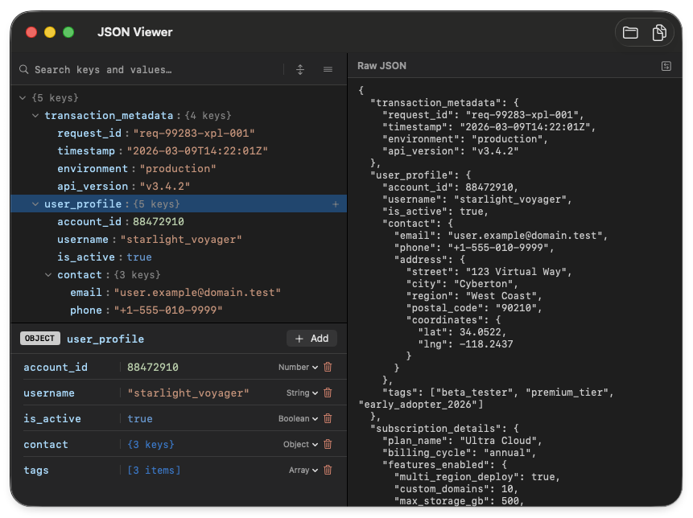

# JSON Viewer for macOS

A lightweight macOS app for viewing and editing JSON files visually.

JSON Viewer gives you two synchronized panels side by side:

- **Tree view** — browse your JSON as a collapsible key/value tree. Click any node to select it, edit its key or value in the inspector below.
- **Raw JSON view** — full text editor showing the live JSON. Edits here update the tree instantly.

Both panels stay in sync at all times. Changes in one reflect immediately in the other.

## Download & Installation

* Download the zip file from Releases section of this repository
* Unzip the file and move `JSON Viewer.app` to your Applications folder

## Opening the App (First Time Only)

Because this app is not notarized by Apple, you will see a security warning on the first launch. Please follow these steps:

* Attempt to open the app and close the warning dialog
* Open System Settings > Privacy & Security
* Scroll down to the Security section
* Click Open Anyway next to the message mentioning JSON Viewer
* Enter your password or use Touch ID to confirm

## Build from Source (Optional)

For those who prefer to verify or customize the code, you can easily build the app yourself using Xcode:

* Clone this repository
* Open `JSONViewer.xcodeproj` in Xcode
* Select your team in Signing & Capabilities
* Press `Cmd + R` to build and run, or Archive to create your own local distribution

## License

[Apache License Version 2.0](LICENSE)
